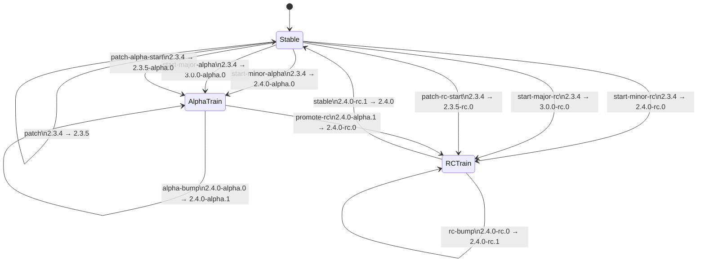

<div align="center">

# revisium-actions

Shared GitHub Actions, reusable workflows, and release automation helpers for
Revisium repositories.

[](LICENSE)
[](https://github.com/revisium/revisium-actions/actions/workflows/ci.yml)
[](https://sonarcloud.io/summary/new_code?id=revisium_revisium-actions)
[](https://sonarcloud.io/summary/new_code?id=revisium_revisium-actions)

</div>

## Current Scope

This repository is being built in small migrations. The first supported helpers
cover release metadata and shared build workflows that are currently duplicated
across service and package repositories:

| Helper                              | Purpose                                                                      |
| ----------------------------------- | ---------------------------------------------------------------------------- |
| `actions/apply-version-metadata`    | Update `package.json`, `package-lock.json`, and optional JSON version files. |
| `actions/validate-version-metadata` | Validate package and optional JSON version files against a target version.   |
| `actions/check-prerelease-deps`     | Reject prerelease runtime dependencies before stable publication.            |
| `actions/plan-release`              | Compute release-train branch, version, tag, and channel transitions.         |

| Reusable workflow                    | Purpose                                                             |
| ------------------------------------ | ------------------------------------------------------------------- |
| `.github/workflows/docker-build.yml` | Build and push Docker images for Revisium service repositories.     |
| `.github/workflows/node-build.yml`   | Install, validate, and build Node.js repositories from one wrapper. |

## Release Workflow State Diagram



The reusable workflow checks out the caller repository, resolves the exact
helper SHA from GitHub's workflow-run metadata, and either prints a plan in
dry-run mode or publishes verified release refs in write mode.

### Branch Model

- `start-minor-*`, `start-major-*`, and `patch-*` actions that create a new
  release train run from `master`.
- `alpha-bump`, `promote-rc`, `rc-bump`, `stable`, and `patch` run from the
  matching `release/X.Y.x` branch.

### Action Options

Use the action that matches the version jump you want to make:

| Action               | Runs from       | Example transition                |
| -------------------- | --------------- | --------------------------------- |
| `start-minor-alpha`  | `master`        | `2.3.4` → `2.4.0-alpha.0`         |
| `start-major-alpha`  | `master`        | `2.3.4` → `3.0.0-alpha.0`         |
| `start-minor-rc`     | `master`        | `2.3.4` → `2.4.0-rc.0`            |
| `start-major-rc`     | `master`        | `2.3.4` → `3.0.0-rc.0`            |
| `start-minor-stable` | `master`        | `2.3.4` → `2.4.0`                 |
| `start-major-stable` | `master`        | `2.3.4` → `3.0.0`                 |
| `alpha-bump`         | `release/X.Y.x` | `2.4.0-alpha.0` → `2.4.0-alpha.1` |
| `promote-rc`         | `release/X.Y.x` | `2.4.0-alpha.1` → `2.4.0-rc.0`    |
| `rc-bump`            | `release/X.Y.x` | `2.4.0-rc.0` → `2.4.0-rc.1`       |
| `stable`             | `release/X.Y.x` | `2.4.0-rc.1` → `2.4.0`            |
| `patch`              | `release/X.Y.x` | `2.4.0` → `2.4.1`                 |
| `patch-alpha-start`  | `master`        | `2.4.0` → `2.4.1-alpha.0`         |
| `patch-rc-start`     | `master`        | `2.4.0` → `2.4.1-rc.0`            |

The release train reusable workflow supports dry runs and real branch/tag
publishing through the release GitHub App:

```yaml
permissions:
  actions: read
  contents: read

jobs:
  release-train:
    uses: revisium/revisium-actions/.github/workflows/release-train.yml@v0.3.1
    with:
      action: ${{ inputs.action }}
      dry_run: true
      node_version: 24.11.1
    secrets:
      RELEASE_BOT_PRIVATE_KEY: ${{ secrets.RELEASE_BOT_PRIVATE_KEY }}
```

The workflow resolves the exact `revisium-actions` reusable workflow SHA from
GitHub's workflow-run metadata, so caller repositories do not need to pass a
second helper ref. Set `dry_run: false` and configure
`RELEASE_BOT_CLIENT_ID` / `RELEASE_BOT_PRIVATE_KEY` to publish a GitHub-verified
release commit, release branch, and tag.

The build workflows follow the same pattern. Keep the trigger and repo-specific
branch policy in the caller repository, then call one of the reusable workflows
with only the shape-specific inputs:

```yaml
jobs:
  build:
    uses: revisium/revisium-actions/.github/workflows/docker-build.yml@v0.3.1
    with:
      image_name: ${{ github.event.repository.name }}
      context: .
      dockerfile: Dockerfile
    secrets: inherit
```

```yaml
jobs:
  build:
    uses: revisium/revisium-actions/.github/workflows/node-build.yml@v0.3.1
    with:
      node_version: 24.11.1
      install_command: npm ci
      run_commands: |
        npm run lint
        npm test
        npm run build
```

## Example

```yaml
- uses: revisium/revisium-actions/actions/plan-release@v0.3.1
  id: release
  with:
    action: start-minor-alpha
    dry-run: true

- uses: revisium/revisium-actions/actions/apply-version-metadata@v0
  with:
    target-version: ${{ steps.release.outputs.target_version }}
    version-files: |
      src/api/rest-api/openapi.json

- uses: revisium/revisium-actions/actions/validate-version-metadata@v0
  with:
    target-version: ${{ steps.release.outputs.target_version }}
    version-files: |
      src/api/rest-api/openapi.json

- uses: revisium/revisium-actions/actions/check-prerelease-deps@v0
  with:
    target-version: ${{ steps.release.outputs.target_version }}
```

## Validation

```bash
npm ci
npm run validate
```

`npm run validate` runs ESLint, Prettier, Node tests, action metadata docs
checks, and actionlint when an `actionlint` binary is installed locally. CI runs
the real actionlint check in a separate job.

## Documentation

- [Release instructions](docs/releasing.md)
- [Release bot integration](docs/release-bot.md)
- [Dry-run release train example](examples/workflows/release-train-dry-run.yml)
- [Release metadata example workflow](examples/workflows/release-metadata.yml)
- [Docker build example workflow](examples/workflows/docker-build.yml)
- [Node build example workflow](examples/workflows/node-build.yml)
