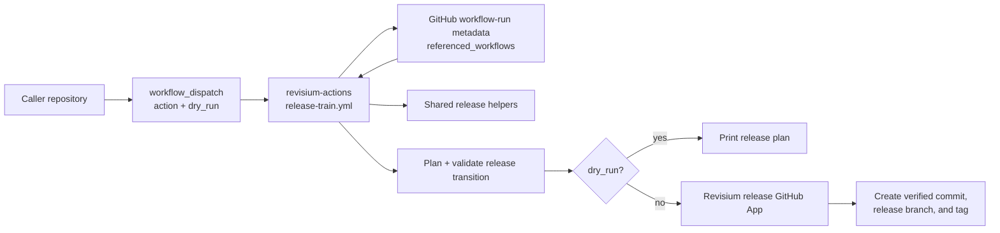

# Release Instructions

`revisium-actions` is consumed by other repositories through GitHub Actions
references such as:

```yaml
uses: revisium/revisium-actions/.github/workflows/docker-build.yml@v1
uses: revisium/revisium-actions/.github/workflows/release-train.yml@v1.0.0
```

For this reason, releases are intentionally simple and tag-driven. The first
releases are created manually. Do not make releasing this repository depend on
unreleased code from this repository.

## Release Workflow Architecture



The reusable workflow checks out the caller repository, resolves the exact
helper SHA from GitHub's workflow-run metadata, and either prints a plan in
dry-run mode or publishes verified release refs in write mode.

## Versioning Policy

- Use semver release tags: `v0.1.0`, `v0.2.0`, `v1.0.0`.
- Maintain moving major tags after each release:
  - `v0` points to the latest compatible `0.x` release.
  - `v1` points to the latest compatible `1.x` release.
- Caller repositories should pin critical release automation to exact tags such
  as `@v1.0.0`.
- Caller repositories may use major tags such as `@v1` for lower-risk workflows
  like Docker build, deploy, lint, or validation helpers.

## When To Cut `v0.1.0`

Cut `v0.1.0` after the initial repository foundation is ready:

- README and docs exist.
- Actions and reusable workflows have examples.
- Tests cover shared JavaScript release logic.
- ESLint, Prettier, and actionlint pass.
- CI runs the full validation script.

## `v0.3.1` Release Train Scope

`v0.3.1` supports write-mode release train publishing. It is intended to run
alpha, rc, stable, and patch transitions in real repositories while keeping the
consumer workflow small.

The reusable workflow is:

```yaml
permissions:
  actions: read
  contents: read

jobs:
  release-train:
    uses: revisium/revisium-actions/.github/workflows/release-train.yml@v0.3.1
    with:
      action: start-minor-alpha
      dry_run: false
      install_command: npm ci
      validate_command: |
        npm run typecheck
        npm run build
    secrets:
      RELEASE_BOT_PRIVATE_KEY: ${{ secrets.RELEASE_BOT_PRIVATE_KEY }}
```

The workflow checks out the caller repository, computes the release train
transition, applies version metadata in the runner workspace, validates stable
runtime dependencies, runs the caller's validation commands, and either prints
the plan in dry-run mode or pushes the release branch and tag in write mode.

The workflow resolves the exact `revisium-actions` reusable workflow SHA from
GitHub's workflow-run metadata, so consumers do not pass a duplicate helper ref.

Write mode requires the caller repository to configure:

- `RELEASE_BOT_CLIENT_ID` as an Actions variable.
- `RELEASE_BOT_PRIVATE_KEY` as an Actions secret.

## Manual Release

Run these commands from the repository root:

```bash
cd path/to/revisium-actions

npm ci
npm run validate

git status --short
git tag -a v0.1.0 -m "v0.1.0"
git push origin master
git push origin v0.1.0
```

Create the GitHub Release from the pushed tag in the GitHub UI, or with:

```bash
gh release create v0.1.0 \
  --title "v0.1.0" \
  --notes-file CHANGELOG.md
```

If there is no changelog yet, use the GitHub UI and write concise release notes
manually.

## Move The Major Alias

After pushing `v0.1.0`, move the `v0` major tag:

```bash
git tag -f v0 v0.1.0
git push origin -f v0
```

After pushing `v1.0.0`, move the `v1` major tag:

```bash
git tag -f v1 v1.0.0
git push origin -f v1
```

Only move a major alias after validation passes and the exact release tag has
been pushed.

## Cutting `v1.0.0`

Cut `v1.0.0` only after at least one Revisium caller repository has used a
`v0.x` release successfully.

Recommended gate before `v1.0.0`:

- One service has migrated Docker build or deploy to `revisium-actions`.
- One service has migrated release-train helper actions.
- The release bot integration has been tested from a caller repository.
- The public action inputs and workflow inputs are stable enough to support as a
  `v1` contract.

Release commands:

```bash
cd path/to/revisium-actions

npm ci
npm run validate

git status --short
git tag -a v1.0.0 -m "v1.0.0"
git push origin master
git push origin v1.0.0

git tag -f v1 v1.0.0
git push origin -f v1
```

## Dogfooding Rules

Good self-use:

- workflow linting
- README and docs checks
- example workflow validation
- tests for shared JavaScript modules

Avoid:

- release tagging that depends on `revisium-actions@master`
- release tagging that depends on an action from the same unreleased commit
- circular workflows where this repository must consume its own unpublished
  version to publish itself

The release workflow for this repository, if added later, should stay small:
validate, tag, create a GitHub Release, and move the major alias.
